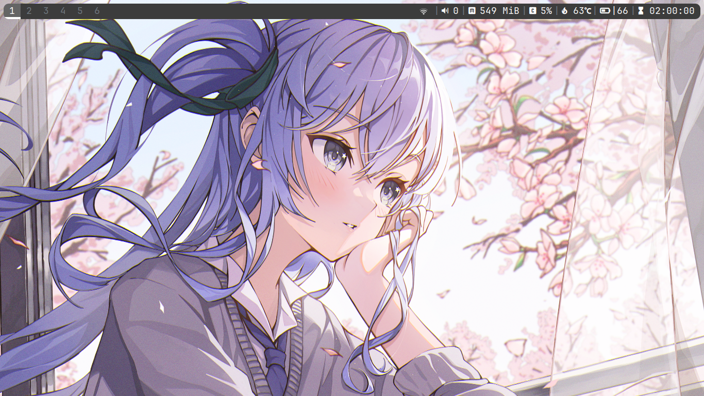

# BSPWM ARCH

<p align="center">
  
</p>

**BSPWM** Configuration files for **Macbook Air Late 2011 A1370**

## Infomation

|       OS       |               [Arch Linux](https://archlinux.org/)               |
| :------------: | :--------------------------------------------------------------: |
|   AUR Helper   |               [yay](https://github.com/Jguer/yay)                |
|     Shell      |                  [Fish](https://fishshell.com/)                  |
| Window Manager |          [BSPWM](https://github.com/baskerville/bspwm)           |
|      Bar       |          [Polybar](https://github.com/polybar/polybar)           |
| Compositor |          [Picom](https://github.com/yshui/picom)           |
|      Menu      |            [Rofi](https://github.com/davatorium/rofi)            |
|    Terminal    |           [Kitty](https://github.com/kovidgoyal/kitty)           |
|  File Manager  |   [Thunar](https://archlinux.org/packages/extra/x86_64/thunar)   |
|    Browser     | [Chromium](https://archlinux.org/packages/extra/x86_64/chromium) |
|  Text Editor   |             [VSCode / micro](https://aur.archlinux.org/packages/visual-studio-code-bin)             |
|     Theme      |        [Mojave GTK](https://www.gnome-look.org/p/1275087)        |
|     Icons      |           [Kora](https://www.gnome-look.org/p/1256209)           |

## Installation

### AUR Helper

The initial installation of Yay

```sh
$ sudo pacman -Syu --needed micro git base-devel
$ git clone https://aur.archlinux.org/yay.git && cd yay
$ makepkg -si
$ cd && rm -rf yay
```

#### MAKEPKG

Speed up compiling of AUR packages

```sh
$ sudo micro /etc/makepkg.conf


MAKEFLAGS="-j4"
```

#### Pacman setting-up

Parallel downloading of packages

```sh
$ sudo micro /etc/pacman.conf


ParallelDownloads = 5
Color
```

---

#### Installing packages

> Assuming your **AUR Helper** is [yay](https://github.com/Jguer/yay).

```sh
$ yay -S --needed \

# Xorg
xorg-server xorg-xinit xorg-xrandr xorg-xsetroot \

# System Environment
bspwm sxhkd polybar rofi rofi-power-menu feh kitty fish dunst picom \

# File Manager
thunar xdg-user-dirs xfce-polkit tumbler lxappearance-gtk3 \

# Text Editors
visual-studio-code-bin micro \

# Media Players
vlc \

# User Software
telegram-desktop qbittorrent chromium obs-studio \

# CLI Programs
go rust yt-dlp ffmpeg fastfetch btop eza fzf fd lazygit ripgrep bat bat-extras maim xdotool xclip xsel reflector jq man-db man-pages-ru \

# File Archiver
p7zip zip unrar unzip xarchiver \

# Fonts & Icons
ttf-jetbrains-mono-nerd noto-fonts noto-fonts-emoji noto-fonts-cjk papirus-icon-theme \

# Drivers
mesa lib32-mesa mesa-utils xf86-video-intel xf86-input-libinput broadcom-wl \

# Network Manager
networkmanager nm-connection-editor network-manager-applet \

# Utility
acpid brightnessctl auto-cpufreq \

# RDP Client
remmina freerdp
```

#### Copy configuration files

```sh
$ git clone https://github.com/masajinobe-ef/arch-bspwm-macbook

# ~/.config
$ mkdir -p ~/.config && cp -r ~/arch_bspwm_macbook/config/* ~/.config

# ~/.local/bin
$ mkdir -p ~/.local/bin && cp -r ~/arch_bspwm_macbook/bin/* ~/.local/bin

# Make executable
$ sudo chmod +x ~/.config/bspwm/bspwmrc
$ sudo chmod +x ~/.config/polybar/polybar.sh

# Misc
$ cp -r ~/arch-bspwm-macbook/misc/. ~
```

#### Internet (only for macbook)

```sh
$ sudo micro /etc/modprobe.d/blacklist.conf


blacklist ssb 
blacklist mmc_core
blacklist b43
blacklist brcmsmac
blacklist brcmutil
blacklist cordic
blacklist mac80211
blacklist bcma

blacklist iTCO_wdt
blacklist iTCO_vendor_support


$ sudo mkinitcpio -P
$ sudo modprobe wl
```

#### Daemons

```sh
$ sudo systemctl enable acpid --now
$ sudo systemctl enable NetworkManager --now
$ sudo systemctl enable auto-cpufreq  --now
$ sudo systemctl enable fstrim.timer --now # For SSD
```

---

#### Setting-up

Adding language

```sh
$ sudo micro /etc/locale.gen


ru_RU.UTF-8 UTF-8


$ sudo locale-gen
```

Configure keyboard layout in Xorg

```sh
$ sudo localectl --no-convert set-x11-keymap us,ru pc105+inet qwerty grp:alt_shift_toggle
```

Config touchpad

```sh
$ sudo micro /etc/X11/xorg.conf.d/30-touchpad.conf


Section "InputClass"
    Identifier "touchpad"
    Driver "libinput"
    MatchIsTouchpad "on"
    Option "NaturalScrolling" "true"
    Option "Tapping" "on"
    Option "TappingButtonMap" "lmr"
    Option "ClickMethod" "clickfinger"
    Option "AccelProfile" "flat"
    Option "TransformationMatrix" "1 0 0 0 1 0 0 0 1"
EndSection
```

Config mouse

```sh
$ sudo micro /etc/X11/xorg.conf.d/30-pointer.conf


Section "InputClass"
    Identifier "pointer"
    Driver "libinput"
    MatchIsPointer "on"
    Option "NaturalScrolling" "false"
    Option "AccelProfile" "flat"
    Option "TransformationMatrix" "1 0 0 0 1 0 0 0 1.2"
EndSection
```

Config keyboard (only for macbook)

```sh
$ sudo micro /etc/modprobe.d/hid_apple.conf


options hid_apple fnmode=2 iso_layout=1


$ sudo mkinitcpio -P
```

Config mkinitcpio (only for macbook)

```sh
$ sudo micro /etc/mkinitcpio.conf


# add vfat to other modules for fix "Failed to mount /boot ... unknown filesystem vfat"
MODULES=(vfat)


$ sudo mkinitcpio -P
```

Config vconsole

```sh
$ sudo micro /etc/vconsole.conf


XKBLAYOUT=us,ru
XKBMODEL=pc105+inet
XKBOPTIONS=grp:alt_shift_toggle
XKBVARIANT=qwerty
KEYMAP=us
FONT=cyr-sun16
USECOLOR=yes
```

Config GRUB

```sh
$ sudo micro /etc/default/grub


GRUB_CMDLINE_LINUX_DEFAULT="loglevel=3 mitigations=off splash intel_pstate=disable nowatchdog"


$ sudo grub-mkconfig -o /boot/grub/grub.cfg
```

Config auto-cpufreq

```sh
$ sudo sensors-detect
$ sudo micro /etc/auto-cpufreq.conf


[charger]
governor = performance
energy_performance_preference = performance

scaling_min_freq = 800000
scaling_max_freq = 1801000

# turbo boost setting. possible values: always, auto, never
turbo = always

[battery]
governor = powersave
energy_performance_preference = power

scaling_min_freq = 800000
scaling_max_freq = 1800000

# turbo boost setting (always, auto, or never)
turbo = never

# battery charging threshold
# reference: https://github.com/AdnanHodzic/auto-cpufreq/#battery->
# enable_thresholds = true
# start_threshold = 20
# stop_threshold = 80
```

---

#### Other

Fisher (Fish)

```sh
$ curl -sL https://raw.githubusercontent.com/jorgebucaran/fisher/main/functions/fisher.fish | source && fisher install jorgebucaran/fisher
```

Fish Plugins List:

```sh
jorgebucaran/fisher
jethrokuan/z
patrickf1/fzf.fish
franciscolourenco/done
jorgebucaran/autopair.fish
nickeb96/puffer-fish
ramlev/mkcd
meaningful-ooo/sponge
ilancosman/tide@v6
```
